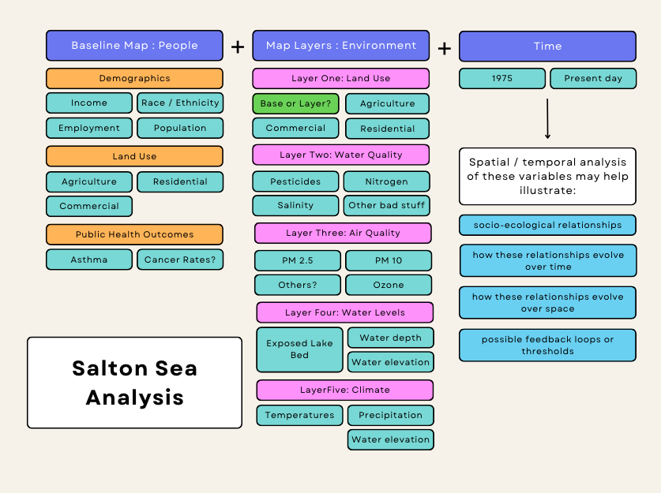

# Salton_Sea_Environmental_Disaster
The final research project for UCLA UP 221, created by Maggie Seay, Tiffany Rivera, Miriam Bar-Zemer, and Seth Reichert
---------------------------------------------------
# Project Proposal
Terminal lakes have been particularly susceptible to climate change and drought in recent years, with many on the verge of drying up. As these lakes dry, there can be many environmental and health impacts on the nearby populations. The Salton sea provides an example of how these terminal lakes are impacted by both climate change and industry, and how the consequences these changes can have on local communities. 

### Broad Research Question:
What are the impacts of drought and climate cange on the Salton Sea? How have these environmental changes impacted the nearby populations?

### Spatial Components:
Our spatial scope includes the immediate area of the Salton Sea, which is situated between including Riverside and Imperial counties. Depending on data availability we hope to explore changes over time from the 1960s to the present day.

Our spatial questions include (focused research questions):
- Who lives in the area and who is impacted by the air quality concerns?
- How wide ranging the problem with air quality?
- How are land values in the area distributed? 
  - How have they changed over time?
- How has the population changed over time? 
  - Are people leaving the area?

### Datasets:
Census/ACS population variables

Quarterly Water Quality Surveys - Salton Sea - Department of Fish and Wildlife
https://data.cnra.ca.gov/dataset/quarterly-water-quality-surveys-salton-sea-ds429

EPA Air Quality Data (maybe we can look in surrounding areas over time?)
https://www.epa.gov/outdoor-air-quality-data/download-daily-data

Public Health Data? CDC?
- California Public Health https://data.chhs.ca.gov/dataset/dataset-catalog

Undocumented Farming Communities!

### Preliminary Methodology / Flow Chart

### Concluding

